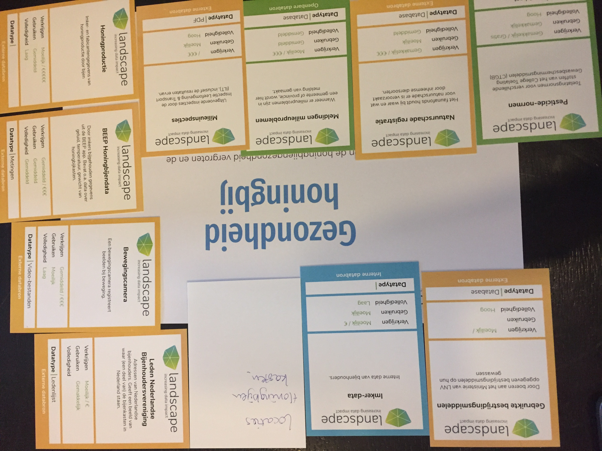
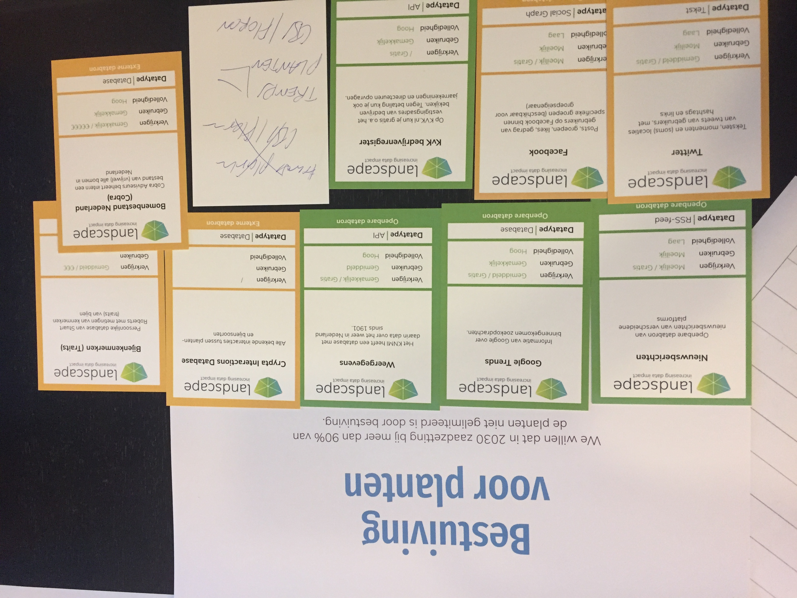
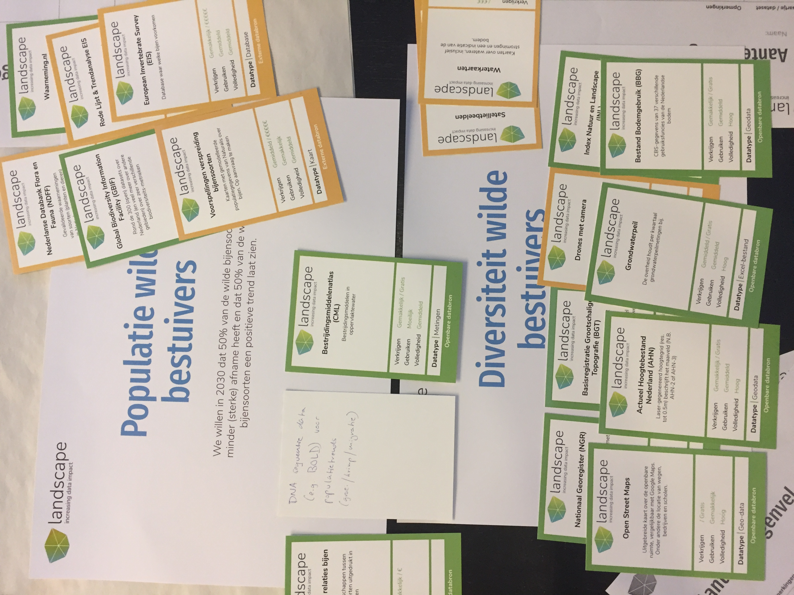

In de eerste brainstorm hebben we de kaartjes georganiseerd zoals in de volgende foto's:

Vervolgens hebben we gekozen voor het hoofddoel 'bestuiving voor planten'. We onderscheiden onder meer:

- (social) media data waar het succes van bestuiving wellicht langskomt (foto's van incomplete bestuiving, raar fruit). Actief meten in de toekomst of retrospectief
- trends in planten, bv. bomenbestand, planten trends, gewaspercelen, fruitkwaliteit (veiling, supermarkt)
- data om bestuivers aan planten te koppelen, bv. trait data, interactie data, rode lijst
